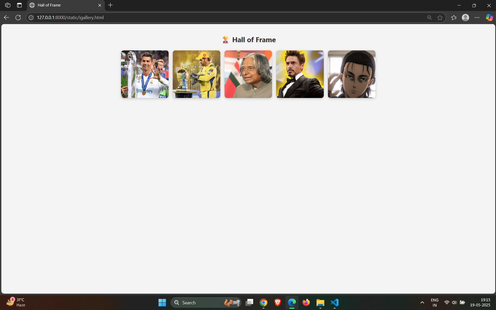
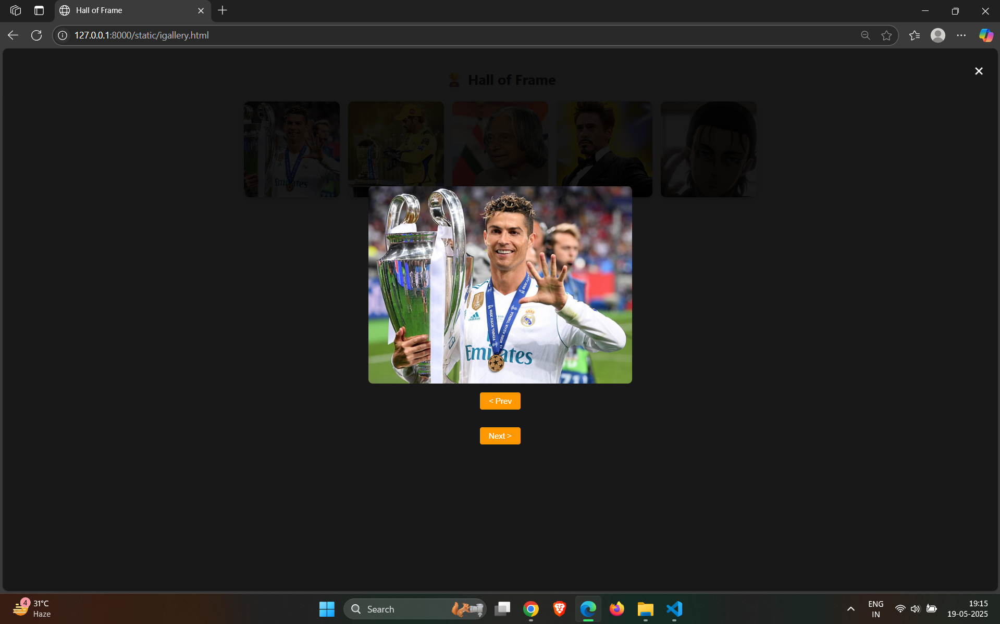
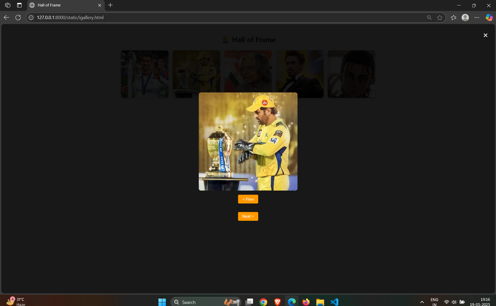
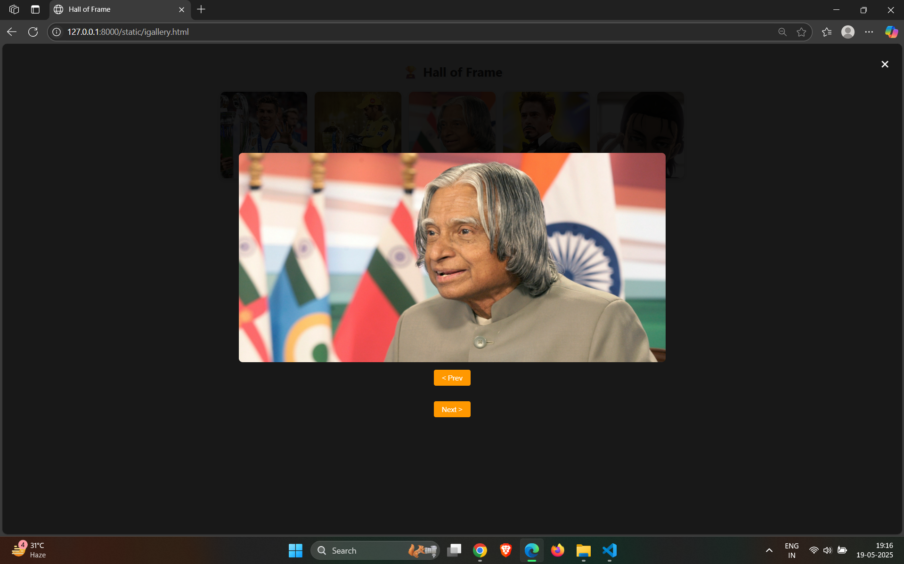
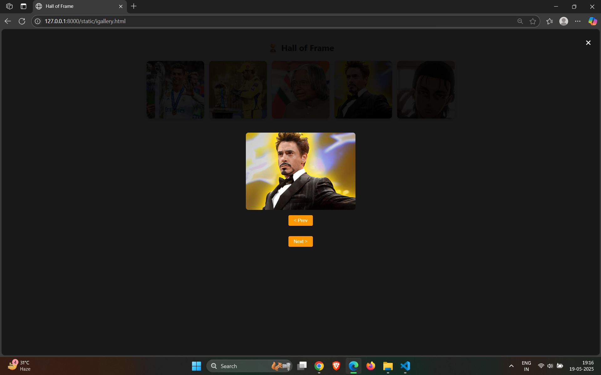
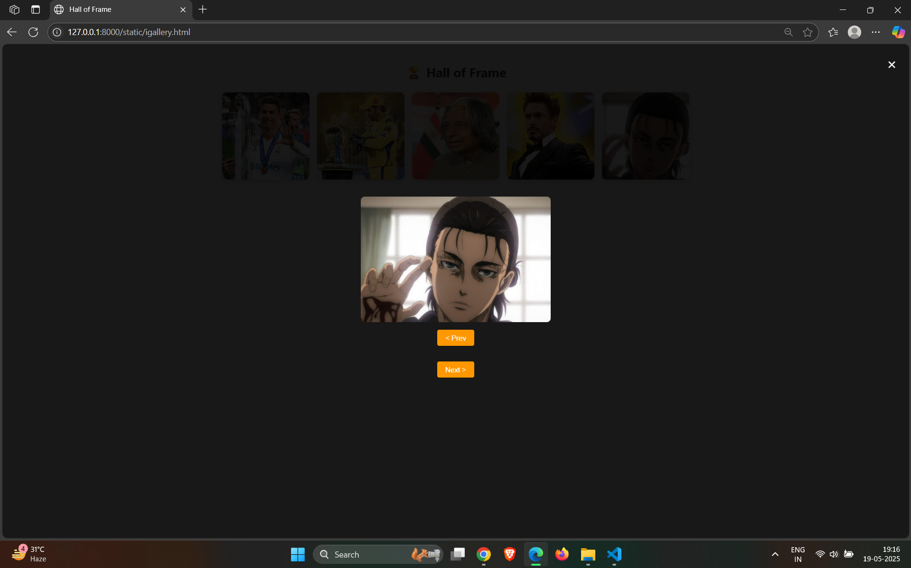

# Ex.08 Design of Interactive Image Gallery
## Date:

## AIM:
To design a web application for an inteactive image gallery with minimum five images.

## DESIGN STEPS:

### Step 1:
Clone the github repository and create Django admin interface.

### Step 2:
Change settings.py file to allow request from all hosts.

### Step 3:
Use CSS for positioning and styling.

### Step 4:
Write JavaScript program for implementing interactivity.

### Step 5:
Validate the HTML and CSS code.

### Step 6:
Publish the website in the given URL.

## PROGRAM :
```
<!DOCTYPE html>
<html lang="en">
<head>
    <meta charset="UTF-8" />
    <meta name="viewport" content="width=device-width, initial-scale=1.0" />
    <title>Hall of Frame</title>
    <link rel="stylesheet" href="Gallery.css" />
    <style>
        body {
            font-family: 'Segoe UI', sans-serif;
            background: #f4f4f4;
            text-align: center;
            padding: 20px;
        }

        h1 {
            color: #333;
            margin-bottom: 30px;
            text-shadow: 2px 2px 5px rgba(0,0,0,0.1);
        }

        .gallery {
            display: flex;
            flex-wrap: wrap;
            justify-content: center;
            gap: 20px;
        }

        .gallery img {
            width: 220px;
            height: 220px;
            object-fit: cover;
            border-radius: 12px;
            box-shadow: 0 4px 12px rgba(0,0,0,0.2);
            transition: transform 0.3s ease;
            cursor: pointer;
        }

        .gallery img:hover {
            transform: scale(1.05);
        }

        #lightbox {
            position: fixed;
            top: 0; left: 0;
            width: 100%; height: 100%;
            background: rgba(0,0,0,0.9);
            display: none;
            justify-content: center;
            align-items: center;
            flex-direction: column;
        }

        #lightbox img {
            max-width: 80%;
            max-height: 80%;
            border-radius: 10px;
        }

        #close-btn {
            position: absolute;
            top: 20px; right: 30px;
            font-size: 40px;
            color: white;
            cursor: pointer;
        }

        #prev-btn, #next-btn {
            margin: 20px;
            padding: 10px 20px;
            font-size: 18px;
            border: none;
            border-radius: 5px;
            background-color: #ff9800;
            color: white;
            cursor: pointer;
        }

        #prev-btn:hover, #next-btn:hover {
            background-color: #e68900;
        }
    </style>
</head>
<body>
    <h1>🏆 Hall of Frame</h1>

    <div class="gallery" onclick="openLightbox(event)">
        
        
        
        
        
    </div>

    <div id="lightbox">
        <span id="close-btn" onclick="closeLightbox()">&times;</span>
        
        <div id="thumbnail-container"></div>
        <button id="prev-btn" onclick="changeImage(-1)">&lt; Prev</button>
        <button id="next-btn" onclick="changeImage(1)">Next &gt;</button>
    </div>

    <script src="Gallery.js"></script>
</body>
</html>

```
## OUTPUT:






## RESULT:
The program for designing an interactive image gallery using HTML, CSS and JavaScript is executed successfully.
